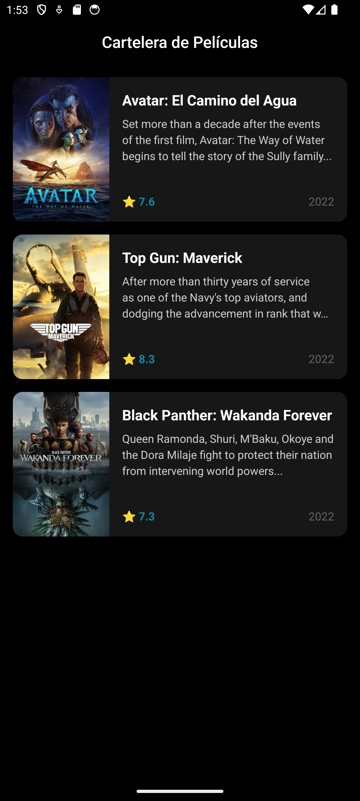
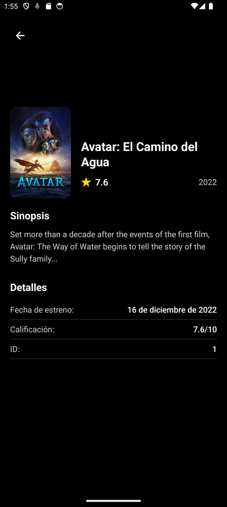

# Movies Explorer - App de Consulta de Películas

## 1. Identificación del Proyecto

- **Nombre de la App:** Movies Explorer
- **Asignatura/Profesor:** Desarrollo de Aplicaciones Móviles / M.C. Leonel González Vidales
- **Periodo/Fecha:** Agosto-Diciembre 2025
- **URL del Repositorio:** https://github.com/l3onet/movies-explorer-app

## 2. Propósito y Alcance del README

Esta aplicación móvil permite consultar información de películas mediante una interfaz intuitiva con cartelera y detalles. La aplicación incluye navegación entre pantallas, visualización de listas de películas con datos simulados, y pantallas de detalle con información completa de cada película. Actualmente utiliza datos mockeados para demostrar la funcionalidad de la interfaz.

## 3. Prerrequisitos y Versiones

### Herramientas Requeridas:

- **Sistema Operativo:** macOS 12+, Windows 10+ o Ubuntu 18.04+
- **Node.js:** v18.17.0 o superior
  ```bash
  node --version
  ```
- **Yarn:** v1.22.19 o NPM 9.0.0+
  ```bash
  yarn --version
  # o
  npm --version
  ```
- **Expo CLI:** v6.3.0+
  ```bash
  npx expo --version
  ```
- **Android Studio:** v2022.3+ con Android SDK 33+ **o** Expo Go app en dispositivo físico
  ```bash
  # Verificar Android SDK
  adb --version
  ```

### Verificación de Entorno:
```bash
npx expo doctor
```

## 4. Estructura del Proyecto

### Estructura Actual:
```
moviesapp/
├── App.tsx                    # Componente principal con navegación
├── app.json                   # Configuración de Expo
├── package.json               # Dependencias del proyecto
├── tsconfig.json              # Configuración de TypeScript
├── index.ts                   # Punto de entrada
├── assets/                    # Recursos estáticos
│   ├── adaptive-icon.png
│   ├── favicon.png
│   ├── icon.png
│   └── splash-icon.png
└── src/
    ├── navigations/           # Configuración de navegación
    │   ├── AppNavigation.tsx
    │   ├── index.ts
    │   └── types.ts
    ├── screens/               # Pantallas de la aplicación
    │   └── Movies/
    │       ├── MoviesListScreen.tsx
    │       ├── MovieDetailScreen.tsx
    │       └── index.ts
    ├── types/                 # Definiciones de tipos TypeScript
    │   └── movie.ts
    └── utils/                 # Utilidades y constantes
        ├── index.ts
        └── screens.ts
```

### Características Implementadas:
- ✅ Navegación con React Navigation (Stack Navigator)
- ✅ Pantalla de lista de películas con datos simulados
- ✅ Pantalla de detalle de película
- ✅ Interfaz con tema oscuro
- ✅ TypeScript para tipado estático
- ✅ Componentes reutilizables

## 5. Dependencias del Proyecto

### Dependencias Principales:

| Dependencia | Versión | Propósito |
|-------------|---------|-----------|
| `expo` | ^54.0.7 | Framework principal de Expo |
| `react` | 19.1.0 | Biblioteca principal de React |
| `react-native` | 0.81.4 | Framework de React Native |
| `@react-navigation/native` | ^7.1.17 | Core de navegación entre pantallas |
| `@react-navigation/native-stack` | ^7.3.26 | Stack navigator para navegación jerárquica |
| `@react-navigation/bottom-tabs` | ^7.4.7 | Navegación por pestañas (preparado para futuro uso) |
| `react-native-screens` | ^4.16.0 | Optimización de rendimiento para transiciones nativas |
| `react-native-safe-area-context` | ^5.6.1 | Manejo de áreas seguras (notch, barras de estado) |
| `native-base` | ^3.4.28 | Biblioteca de componentes UI |
| `@expo/vector-icons` | ^15.0.2 | Iconos vectoriales de Expo |
| `expo-status-bar` | ~3.0.8 | Control de apariencia de barra de estado |

### Dependencias de Desarrollo:

| Dependencia | Versión | Propósito |
|-------------|---------|-----------|
| `typescript` | ^5.9.3 | Compilador de TypeScript |
| `@types/react` | ^19.1.16 | Tipos TypeScript para React |
| `@types/react-native` | ^0.73.0 | Tipos TypeScript para React Native |
| `@babel/core` | ^7.25.2 | Compilador de Babel |

### Instalación de Dependencias:
```bash
# Instalar todas las dependencias
npm install

# Verificar instalación
npm list --depth=0
```

## 6. Funcionalidades de la Aplicación

### Pantallas Implementadas:

#### 1. Pantalla de Lista de Películas (`MoviesListScreen`)
- **Funcionalidad:** Muestra una lista de películas con datos simulados
- **Características:**
  - Lista scrollable con FlatList
  - Cards de películas con imagen, título y rating
  - Indicador de carga mientras se cargan los datos
  - Navegación a pantalla de detalle al tocar una película
  - Tema oscuro consistente



#### 2. Pantalla de Detalle de Película (`MovieDetailScreen`)
- **Funcionalidad:** Muestra información detallada de una película seleccionada
- **Características:**
  - Imagen de fondo de la película
  - Información completa: título, sinopsis, fecha de lanzamiento, rating
  - Botón de navegación hacia atrás
  - Diseño responsivo y atractivo

### Navegación:
- **Stack Navigator:** Navegación jerárquica entre lista y detalle
- **Tema consistente:** Interfaz oscura en todas las pantallas
- **Transiciones suaves:** Animaciones nativas entre pantallas

### Datos:
- **Datos simulados:** Películas populares con información completa
- **Estructura de datos:** Interfaz Movie definida en TypeScript
- **Preparado para API:** Estructura lista para integración con APIs reales



## 7. Scripts de Ejecución y Desarrollo

### Scripts Principales:
```bash
# Iniciar servidor de desarrollo
npm start
# o
npx expo start

# Ejecutar en Android (emulador/dispositivo)
npm run android
# o
npx expo start --android

# Ejecutar en iOS (solo macOS)
npm run ios
# o  
npx expo start --ios

# Ejecutar en web
npm run web
# o
npx expo start --web
```

### Opciones de Ejecución:

#### Opción A: Dispositivo Físico con Expo Go
1. **Instalar Expo Go:**
   - Android: [Google Play Store](https://play.google.com/store/apps/details?id=host.exp.exponent)
   - iOS: [App Store](https://apps.apple.com/app/expo-go/id982107779)

2. **Ejecutar proyecto:**
   ```bash
   npx expo start
   ```

3. **Conectar dispositivo:**
   - **Android:** Escanear QR code con Expo Go
   - **iOS:** Usar cámara para escanear QR code

#### Opción B: Emulador Android
1. **Configurar Android Studio:**
   - Crear AVD (Android Virtual Device) con API 33+
   - Iniciar emulador antes de ejecutar el proyecto

2. **Ejecutar en emulador:**
   ```bash
   npx expo start --android
   ```

### Notas de Entorno:
- **Emulador Android:** Debe estar iniciado antes de ejecutar `npm run android`
- **Dispositivo físico:** Usar Expo Go y escanear QR code
- **Túnel para redes restrictivas:** `npx expo start --tunnel`
- **Puerto ocupado:** `npx expo start --port 8082`
- **Metro cache:** `npx expo start --clear`

## 8. Troubleshooting y Solución de Problemas

### Problemas Comunes y Soluciones:

| Problema | Síntoma | Solución |
|----------|---------|----------|
| **Error de instalación NPM** | "npm ERR! peer dep missing" | `npm install --legacy-peer-deps` |
| **SDK Android no encontrado** | "Android SDK not found" | Verificar ANDROID_HOME en variables de entorno |
| **Expo Go no conecta** | QR funciona pero no carga app | Verificar que dispositivo y PC estén en misma red WiFi |
| **Metro bundler falla** | "Metro has encountered an error" | `npx expo start --clear` para limpiar cache |
| **Dependencias desactualizadas** | Warnings en consola | `npx expo doctor` y seguir recomendaciones |
| **TypeScript errors** | Errores de compilación | Verificar tipos en archivos .ts/.tsx |
| **Navegación no funciona** | Pantallas en blanco | Verificar configuración de NavigationContainer |

### Comandos de Verificación:
```bash
# Verificar entorno completo
npx expo doctor

# Limpiar cache de Metro
npx expo start --clear

# Reinstalar node_modules
rm -rf node_modules package-lock.json && npm install

# Verificar puertos disponibles
npx expo start --port 8082

# Verificar tipos TypeScript
npx tsc --noEmit
```

### Notas de Permisos:
- **Android:** Activar "Instalación de fuentes desconocidas" para Expo Go
- **Firewall:** Permitir conexiones en puerto 8081 y 19000-19002
- **ADB no reconoce dispositivo:** `adb kill-server && adb start-server`

## 9. Próximas Funcionalidades

### Funcionalidades Planificadas:
- 🔄 Integración con API real de películas (TMDB)
- 🔄 Sistema de búsqueda de películas
- 🔄 Categorías y filtros por género
- 🔄 Lista de favoritos persistente
- 🔄 Modo offline con caché local
- 🔄 Notificaciones push para nuevos estrenos
- 🔄 Compartir películas en redes sociales

### Recursos Adicionales:
- [Documentación oficial de Expo](https://docs.expo.dev/)
- [React Navigation Docs](https://reactnavigation.org/docs/getting-started)
- [Native Base Components](https://docs.nativebase.io/)
- [Troubleshooting Expo](https://docs.expo.dev/troubleshooting/overview/)

---

**Última actualización:** 2 de octubre de 2025